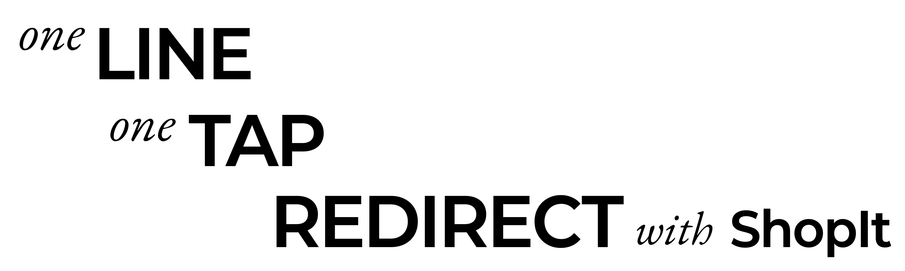

<div align="center">

### One line, One tap
**Redirect with ShopIt**

</div>

```swift
RedirectButton(
    keyword: "iPhone 16 pro", 
    redirection: .amazonShopping
) {
    Text("TAKE MY MONEY!")
}
```

## Features
**ShopIt** simplifies redirection to various online shopping platforms or search engines like Amazon, Google etc.

- **Easy redirection** to popular shopping sites like Amazon, eBay, Walmart, and more. See the complete list at [Supported Platforms](#Supported-Platforms).
- **SwiftUI compatible** for quick integration into your apps.
- **Customizable buttons** for flexible and straightforward redirection.

## Quick link
- Demo app & usage example can be found in [here]()

## Installation

### Swift Package Manager (SPM)
Follow these steps to install **ShopIt** using SPM:

1. From within Xcode 13 or later, choose `File` > `Swift Packages` > `Add Package Dependency`.
2. At the next screen, enter the URL for the **ShopIt** repository in the search bar then click `Next`.
``` Text
https://github.com/enebin/ShopIt.git
```
3. For the `Version rule`, select `Up to Next Minor` and specify the current ShopIt version then click `Next`.
4. On the final screen, select the `ShopIt` library and then click `Finish`.

**ShopIt** should now be integrated into your project 🚀

## Usage
### `RedirectButton`
You can simply use the `RedirectButton` to add a redirection to your app:
```swift
RedirectButton(keyword: "iPhone 16 pro", redirection: .amazonShopping) {
    Text("Buy on Amazon")
}
```
_Done!_ 🪄

### `Redirector`
If you need to handle much complicated behavior, then `shopitRedirector` will be the perfert solution. 

Here's how to use it:

1. Register the `openURL` to redirector using `@Environment(\.shopitRedirector)`

```swift
import SwiftUI

struct ContentView: View {
    @Environment(\.openURL) private var openURL
    @Environment(\.shopitRedirector) private var redirector
    
    var body: some View {
        SomeView()
            .onAppear {
                redirector.register(openURL)
            }
    }
}
```
> [!CAUTION]
> YOU MUST register the `openURL` to `redirector` before using it, or you can get error.

> [!Note]  
> `RedirectButton` automatically handles registration of `openURL`. 

2. Perform a redirection

```swift
Button("Buy on Amazon") {
    Task {
        let favorite = await viewModel.getFavoriteProduct()
        try await redirector.redirect(keyword: favorite, to: .amazonShopping)
    }
}

```

### Custom redirection
Don't worry if the platform you're looking for isn't available. ShopIt supports creating your own redirections.

You can define custom redirections by conforming to the `Redirectable` protocol. Here's a quick example:

``` Swift
struct ExampleShopRedirection: Redirectable {
    public let schemeUrl: QueryableURL
    public let webUrl: QueryableURL
    
    init() {
        self.schemeUrl = QueryableURL(
            baseURL: URL(string: "exampleshop://search")!
        ) { keyword in
            [URLQueryItem(name: "query", value: keyword)]
        }
        
        self.webUrl = QueryableURL(
            baseURL: URL(string: "https://www.exampleshop.com/search")!
        ) { keyword in
            [URLQueryItem(name: "query", value: keyword)]
        }
    }
}

// In a view...
RedirectButton(keyword: "iPhone 16 pro", redirection: ExampleShopRedirection()) {
    Text("Buy This!")
}

// or 
Button("Buy This!") {
    Task {
        try await redirector.redirect(keyword: "iPhone 16 pro", to: ExampleShopRedirection())
    }
}
```

> [!Note]
> If you want to add your own redirection to this package, feel free to submit a PR. Your contributions are always welcome!

## Example
You can explore the complete usage flow in our [demo app]().

## Supported Platforms

| Name        | App    | Web |
|-------------|--------|-----|
| Google      | ✅     | ✅  |
| Amazon      | ✅     | ✅  |
| eBay        | ✅     | ✅  |
| Walmart     | ✅     | ✅  |
| BestBuy     | ✅     | ✅  |
| Coupang     | ✅     | ✅  |
| MarketKurly | ✅     | ✅  |
| Naver Store | ✅     | ✅  |


## Contributing

Contributions are welcome! You can contribute to the project through bug reports, feature suggestions, and pull requests.

## License

This project is licensed under the MIT License. See the LICENSE file for more details.